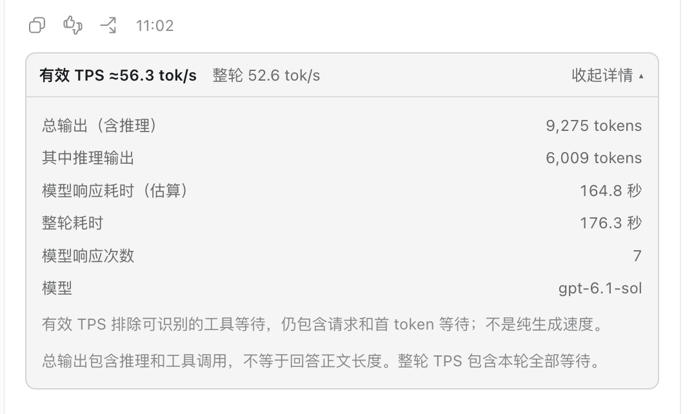
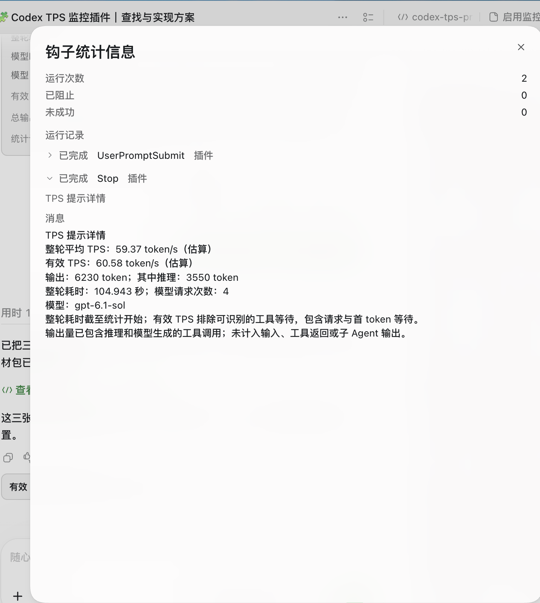

# Codex TPS

在每轮 Codex 回复结束后统计 TPS。保留官方 Stop Hook 详情，并可在 macOS 客户端的回复下方显示一行速度表。



## 当前可以做到什么

- **原生模式**：每轮自动运行 Stop Hook，在“钩子统计信息 → Stop → TPS 提示详情”中查看结果。正常启动客户端即可加载。
- **底部模式（macOS）**：每轮回复下方直接显示 TPS，展开“提示详情”查看计数与耗时。后台监控由 LaunchAgent 维持，通过生成的 **Codex TPS.app** 打开原客户端。
- 一段提示词可以让自己的 Codex 下载、审阅、安装、启用并检查本插件。首次仍可能需要平台权限确认、Hook 信任确认和正常重启。
- 底部模式需要从 Codex TPS 启动入口打开。它是原客户端的启动包装，没有修改客户端安装包。
- 目前没有内置历史趋势页；单轮统计不能独立证明某次官方优化的提速幅度。

这是本地实验插件，当前完整体验以 **macOS 桌面客户端**为目标。实测开发环境为客户端 26.930.61225 / 内置 CLI 0.160.1 / Python 3.9.6。其他系统、CLI/客户端版本没有完成同等端到端验证。

## 复制给自己的 Codex

复制下方提示词给自己的 Codex，让它下载、审阅并安装插件；也可以把 URL 换成已下载的仓库目录。仓库提供完整源码，你可以提出自己的显示或统计需求，让 Codex 在本地修改。

```text
请帮我安装并启用 Codex TPS。
仓库地址：https://github.com/Mie-coder/codex-tps

请先下载仓库，阅读 README、install.py 和 plugins/codex-tps-monitor 下的 Hook 与统计脚本，确认它们适合我的客户端和系统。保留我原有的 Codex 配置与其他 Hook。
在审阅后，我授权你通过官方 marketplace 流程安装本插件、开启 hooks 功能，并仅信任本插件 Stop Hook 的当前精确哈希；不要关闭全局 Hook 信任校验。
在 macOS 上同时配置回复底部显示，使用仓库的 python3 install.py --trust-reviewed-hook --inline；必要时指定 --codex 为当前桌面客户端内置 CLI。其他系统先报告兼容性，不强行配置 macOS 服务。
不要中断我的其他会话或自动退出客户端。准备完成后，告诉我是否需要正常重启，以及 Codex TPS 启动图标的位置。
待客户端加载配置后，用新一轮真实对话检查原生 Stop 记录及底部 TPS 显示。区分“已安装”“已信任”“真实显示已验证”，不要仅凭配置文件就说全部成功。如果平台仍需要我点击授权或信任，请指出具体入口。
```

**提示词是安装任务的入口，实际执行者是用户自己的 Codex。** 需要联网下载、Python 和本机配置写入权限；客户端的权限或 Hook 信任界面可能仍需用户操作。不能保证任意机器上粘贴后立即零点击生效。

## 手动安装

需要 Python 3.9+，以及支持 `plugin` 和 `app-server --stdio` 的 Codex CLI。安装器会寻找 PATH 中的 `codex`，找不到时检查 macOS 客户端内置 CLI；也可用 `--codex /absolute/path/to/codex` 明确指定。

在下载后的仓库根目录运行：

```bash
python3 install.py
```

这会通过官方 CLI 加入本仓库 marketplace、安装插件，并用 App Server 的字段级配置接口开启 hooks。默认**不建立新的 Hook 信任**；请在客户端 Hook 设置或 CLI 的 `/hooks` 中审阅并信任 TPS Stop Hook。

如果你已审阅安装器、Hook 与统计代码，并同意执行这一条 TPS Hook：

```bash
python3 install.py --trust-reviewed-hook
```

此选项只保存本插件当前定义的精确哈希，校验安装副本与当前仓库代码一致，并保留其他 Hook 状态。未使用任何绕过 Hook 信任的选项。

macOS 同时启用底部显示：

```bash
python3 install.py --trust-reviewed-hook --inline
```

安装器不会自动关闭客户端。等正在进行的工作结束后，正常完全退出客户端，再打开：

```text
~/Applications/Codex TPS.app
```

以后从这个图标打开，后台监控会自动恢复，无需每次执行命令。原生 Hook 模式不需要这个图标或调试端口。

只使用原生安装命令也可以发现插件：

```bash
codex plugin marketplace add /absolute/path/to/this/repository
codex plugin add codex-tps-monitor@mie-codex-tps
```

marketplace 地址也可以使用 `https://github.com/Mie-coder/codex-tps`。目录必须完整包含隐藏的 `.agents/plugins/marketplace.json` 和插件的 `.codex-plugin/plugin.json`；不要只上传 README 或 scripts。

## 查看与检查



在插件安装目录或 `plugins/codex-tps-monitor` 中运行：

```bash
python3 scripts/stop_hook.py --status
python3 scripts/control.py status
```

第一条显示最近保存的统计，不能单独证明当前 Hook 已执行。第二条检查底部显示服务的自身状态；`rendered > 0`、活动会话准确匹配和状态新鲜是重要运行证据。

首次安装或配置更新后，客户端可能需要新会话或正常重启。发一轮普通消息，确认原生 Stop 已完成、出现“TPS 提示详情”；底部模式再确认回复下方的统计行。如果原生模式可用而底部缺失，先检查是否从 Codex TPS 入口启动以及调试连接是否建立。

## TPS 怎么算

| 指标 | 计算方式 | 包含的时间 |
| --- | --- | --- |
| 整轮 TPS | 输出 token ÷ 整轮耗时 | 包含工具等待和模型请求等待 |
| 有效 TPS | 输出 token ÷ 可识别的模型响应耗时 | 排除可识别工具等待，仍包含请求与首 token 等待 |

输出已包含推理和模型生成的工具调用，推理不会重复相加；不计输入、工具返回或子 Agent 输出。缺少用量或模型时间边界时，相应读数显示不可用。

Stop Hook 在 task_complete 前执行，整轮时间截至脚本进入；底部统计使用已完成事件，因此两个入口可能有细微差异。有效 TPS 是日志估算，不能等同于服务端纯解码速度。

## 数据与卸载

统计在本机完成。安装器联网只用于 Codex marketplace 下载；统计脚本不向外部统计服务发送数据，不保存聊天正文，也不修改客户端包或会话日志。

| 内容 | 默认位置 |
| --- | --- |
| 配置备份 | `$CODEX_HOME/codex-tps-backups/`（默认 `~/.codex/`） |
| Hook 统计 | 由 Codex 提供的 `PLUGIN_DATA/tps-results/` |
| 底部显示运行代码和诊断 | `~/Library/Application Support/Codex TPS/` |
| 启动服务 | `~/Library/LaunchAgents/mie.codex-tps.plist` |
| 启动入口 | `~/Applications/Codex TPS.app` |

在 macOS 上移除底部显示服务及图标，再卸载原生插件：

```bash
python3 plugins/codex-tps-monitor/scripts/control.py auto-remove
codex plugin remove codex-tps-monitor@mie-codex-tps
```

保留统计和配置备份便于排查。安装器采用字段级更新，不会把整个 config.toml 换成模板；备份可能含你的私有配置，勿上传 GitHub。

## 开发、验证与更新

```bash
python3 -m unittest discover -s plugins/codex-tps-monitor/tests
node plugins/codex-tps-monitor/tests/test_identity.js
python3 -m unittest discover -s tests
```

本发行包通过 24 项 Python 检查和 11 项 JavaScript 检查。使用临时 CODEX_HOME 实测首次安装、精确信任与重复安装，确认其他配置及 Hook 状态保留，未修改开发者的真实配置或监控服务。尚未在第二台机器完成端到端验收；实际统计及底部显示还应在目标客户端完成一轮验证。

Hook 使用官方生命周期接口；底部显示仍依赖 CDP 与客户端 DOM，会话日志格式也可能变化。更新客户端后检查一轮读数；更新插件定义后重新审阅并信任当前哈希。

## 发布到 GitHub

上传**本目录的全部源码和隐藏目录**，使用建议仓库名 `codex-tps`。不要上传当前聊天工作区、会话 JSONL、auth.json、config.toml、.runtime、个人统计或生成的客户端 .app。本发行目录已经与开发记录分开。

当前仓库地址为 https://github.com/Mie-coder/codex-tps；如果发布到自己的新仓库，请同步修改安装提示词中的 URL。仓库可供其他 Codex 通过官方 marketplace 加入；这不等于发布到 OpenAI 的公共插件目录。

## 来源与许可

- [KevinKE93/Codex-Monitor](https://github.com/KevinKE93/Codex-Monitor)：部分 CDP 传输与目标选择代码，MIT 署名保留；见 NOTICE。
- [adenta/codex-tps](https://github.com/adenta/codex-tps)：有效 TPS 口径参考。
- [官方插件打包与 marketplace 文档](https://developers.openai.com/plugins/build/plugins)。
- [官方 Hooks 文档](https://learn.chatgpt.com/docs/hooks)。

MIT；见 LICENSE。本项目与 OpenAI 官方产品没有隶属关系。
